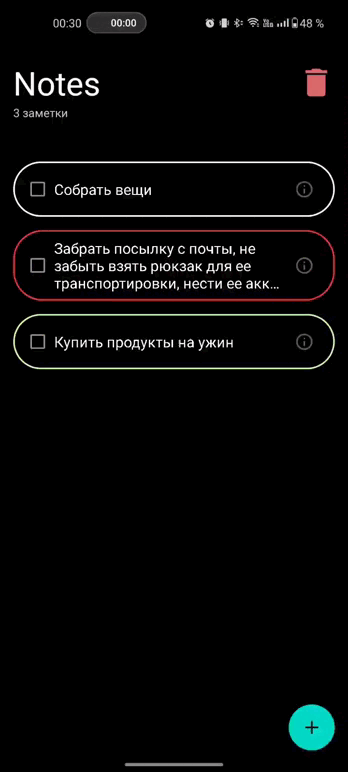

# My Notes
My Notes - приложение списка дел.

При создании новой задачи, заполните текстовое поле, внесите небходимую вам информацию, также вы можете задать ее важность - (Нет / Низкая / Высокая) и дату, до которой необходимо завершить эту задачу. 
После создания задачи, она появится на главном экране. Важность отображается контуром вокруг ячейки задачи. Для изменения задачи, необходимо нажать на нее, и откроется окно с изменением.
Вы можете удалить каждую задачу, нажав на нее и на кнопку "Удалить". Также есть возможность удаления всех заметок.

Приложение написано с использованием архитектурного подхода MVVM. Данные сохраняются в локальную базу данных Room. Навигация между страницами реализована с помощью Navigation Component.

### Ниже вы можете ознакомиться с функционалом приложения:

